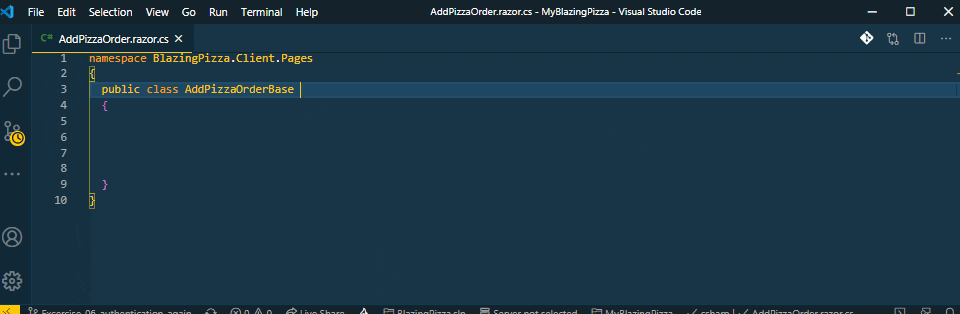

# Blazor Snippets `that start with an y`

## C# code-behind files [(source code)](https://github.com/bartvanhoey/Blazory/blob/master/snippets/blazory_csharp.json)

| Prefix                                 | Description                                      |
| -------------------------------------- | ------------------------------------------------ |
| `yAddHttpClientWithHttpMessageHandler` | Add HttpClient with HttpMessageHandler           |
| `yAuthenticationStateTask`             | Parameter AuthenticationStateTask                |
| `yCascadingParameter`                  | CascadingParameter attribute                     |
| `yEventCallbackExtended`               | EventCallbackExtended Parameter                  |
| `yEventCallbackOnParameterChanged`     | EventCallbackOnParameterChanged                  |
| `yEventCallback`                       | EventCallback Parameter                          |
| `yEventHandlerAsync`                   | EventHandlerAsync method stub                    |
| `yEventHandler`                        | EventHandler method stub                         |
| `yGetFromJsonAsync`                    | GetFromJsonAsync                                 |
| `yHttpClientField`                     | Readonly HttpClient field                        |
| `yInheritsComponentBase`               | Inherits ComponentBase                           |
| `yInjHttpClient`                       | Inject HttpClient property                       |
| `yInjIJSRuntime`                       | Inject IJSRuntime property                       |
| `yInjIMapper`                          | Inject IMapper property                          |
| `yInjNavigationManager`                | Inject NavigationManager property                |
| `yInjService`                          | Inject MyService MyService                       |
| `yInjSignOutSessionStateManager`       | Inject SignOutSessionStateManager property       |
| `yJSRuntimeInvokeAsync`                | JSRuntimeInvokeAsync call                        |
| `yNavigateToId`                        | NavigationManager.NavigateTo page\Id             |
| `yNavigateTo`                          | NavigationManager.NavigateTo page                |
| `yOnAfterRenderAsync`                  | OnAfterRenderAsync method stub                   |
| `yOnAfterRender`                       | OnAfterRender method stub                        |
| `yOnInitializedAsync`                  | OnInitializedAsync method stub                   |
| `yOnInitialized`                       | OnInitialized method stub                        |
| `yOnParametersSet`                     | OnParameterSet method stub                       |
| `yParameterCaptureUnmatchedValues`     | Parameter CaptureUnmatchedValues attribute       |
| `yParameter`                           | Parameter attribute                              |
| `yPostAsJsonAsync`                     | HttpClient.PostAsJsonAsync call                  |
| `yProtAsyncTaskMethodNoParameters`     | protected async Task method stub no parameters   |
| `yProtAsyncTaskMethodWithParameters`   | protected async Task method stub with parameters |
| `yPublicAsyncTaskMethodNoParameters`   | public async Task method stub no parameters      |
| `yPublicAsyncTaskMethodWithParameters` | public async Task method stub with parameters    |
| `yReadIdFromJsonAsync`                 | HttpClient.ReadFromJsonAsync\<int> call          |
| `ySetParametersAsync`                  | SetParametersAsync method stub                   |
| `yShouldRender`                        | ShouldRender method stub                         |

## Razor files [(source code)](https://github.com/bartvanhoey/Blazory/blob/master/snippets/blazory_razor.json)

| Prefix                          | Description                                            |
| ------------------------------- | ------------------------------------------------------ |
| `yAuthorizeAttribute`           | @attribute [Authorize]                                 |
| `yBindFormat`                   | @bind:format="MyFormat"                                |
| `yBindOnInputEvent`             | @bind="MyProperty" @bind:event="oninput"               |
| `yBindValue`                    | @bind-Value="MyProperty"                               |
| `yBind`                         | @bind="MyProperty"                                     |
| `yCascadingAuthenticationState` | CascadingAuthenticationState stub                      |
| `yCode`                         | @code block                                            |
| `yComponentChildContent`        | Complete component with Child content                  |
| `yComponentDisposable`          | Complete component inherits IDisposable                |
| `yComponent`                    | Complete component                                     |
| `yDataAnnotationsValidator`     | DataAnnotationsValidator                               |
| `yImplementsIDisposable`        | @implements IDisposable                                |
| `yInheritsBaseComponent`        | @inherits C# code-behind base class                    |
| `yInheritsLayoutComponentBase`  | Complete Layout component inherits LayoutComponentBase |
| `yInjHttpClient`                | @inject HttpClient directive                           |
| `yInjIJSRuntime`                | @inject IJSRuntime directive                           |
| `yInjIMapper`                   | @inject IMapper directive                              |
| `yInjNavigationManager`         | @inject NavigationManager directive                    |
| `yInjService`                   | @inject MyService MyService                            |
| `yInjSignOutSessionStateManager`| @inject SignOutSessionStateManager directive           |
| `yInputCheckbox`                | Built-in InputCheckbox component                       |
| `yInputDate`                    | Built-in InputDate component                           |
| `yInputNumber`                  | Built-in InputNumber component                         |
| `yInputSelectForEach`           | Built-in InputSelectForEach component                  |
| `yInputSelect`                  | Built-in InputSelect component                         |
| `yInputTextArea`                | Built-in InputTextArea component                       |
| `yInputText`                    | Built-in InputText component                           |
| `yLayout`                       | @layout MyLayout                                       |
| `yNavLinkMatch`                 | NavLink with MatchAttribute                            |
| `yNavLink`                      | NavLink                                                |
| `yOnValidSubmit`                | OnValidSubmit                                          |
| `yPageParam`                    | @page directive with Parameter                         |
| `yPage`                         | @page directive                                        |
| `yPreventDefault`               | @preventDefault                                        |
| `yRef`                          | @ref="MyProperty"                                      |
| `yTemplatedComponent`           | Templated component                                    |
| `yTypeParam`                    | @typeParam                                             |
| `yUsing`                        | @using MyNameSpace                                     |
| `yValidationMessageFor`         | ValidationMessageFor                                   |
| `yValidationSummary`            | ValidationSummary component                            |
| `yVoidDispose`                  | Dispose method stub                                    |

Enjoy!