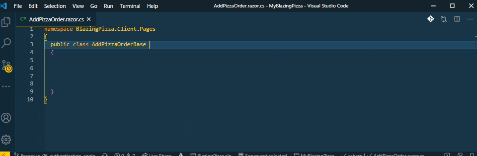

## Snippets `that start with an y` to speed up your Blazor development

Do you see **room for improvement** or do **you have a snippet in mind** you want to have included? Feel free to [create an issue](https://github.com/bartvanhoey/Blazory/issues/new), I will see what I can do!

### C# code-behind files [(source code)](https://github.com/bartvanhoey/Blazory/blob/master/snippets/csharp.json)

     Prefix                                  | Description                                                           
     --------------------------------------- | ---------------------------------------------------------------------- 
     yAddHttpClientWithHttpMessageHandler    | Inserts AddHttpClient with HttpMessageHandler                         
     yApiControllerAttribute                 | inserts an ApiController attribute                                    
     yAuthorizeAttribute                     | Inserts an AuthorizeAttribute                                         
     yBuiAddDbContext                        | Inserts a builder.Services.AddDbContext                               
     yBuiAddDbContextUseSqlServer            | Inserts builder.Services.AddDbContext.Options.UseSqlServer            
     yBuilderEntity                          | inserts builder.Entity stub                                           
     yBuiServicesAddHttpClient               | Inserts builder.Services.AddScoped HttpClient                         
     yBuiServicesAddScoped                   | Inserts builder.Services.AddScoped INameService NameService           
     yCascadingPara                          | Inserts a CascadingParameter attribute                                
     yCascadingParaAuthState                 | Inserts a CascadingParameter AuthenticationState Property             
     yCascadingParaProp                      | Inserts a property with CascadingParameter attribute                  
     yColumnTypeNameDecimalAttribute         | Inserts a ColumnType TypeName decimal attribute                       
     yCompareAttribute                       | Inserts a Compare attribute                                           
     yCreateAsyncMethodDefinition            | Inserts a CreateAsync method Definition to an Interface               
     yDataTypeAttribute                      | Inserts a DataType attribute                                          
     yDbSaveChangesAsync                     | Inserts _dbContext.SaveChangesAsync                                   
     yDbSet                                  | Inserts a DbSet for a class in DbContext                              
     yDbSetNewSyntax                         | Inserts a DbSet for a class in DbContext                              
     yDeleteAsyncMethodDefinition            | Inserts a DeleteAsync method definition for an interface              
     yEmailAddressAttribute                  | Inserts an EmailAddress Attribute                                     
     yEventCallback                          | Inserts an EventCallback property                                     
     yEventCallbackChanged                   | Inserts an EventCallbackChanged property + property                   
     yEventCallbackExtended                  | Inserts an EventCallbackExtended OnClickProperty                      
     yEventHandler                           | Inserts an EventHandler method stub                                   
     yEventHandlerAsync                      | Inserts an EventHandlerAsync method stub                              
     yGenerateClassImplementingInterface     | Generates a class and implements interface                            
     yGetAsyncMethodDefinition               | Inserts a GetAsync method definition for an interface                 
     yGetListAsyncMethodDefinition           | Inserts a GetListAsync definition for an interface                    
     yGps                                    | Inserts { get, private set }                                          
     yGs                                     | Inserts { get, set }                                                  
     yHandleFileChosenAsync                  | Inserts the HandleFileChosenAsync method for an InputFile element     
     yHandleValidSubmitAsync                 | Inserts the HandleValidSubmitAsync method stub                        
     yHttpDeleteAsync                        | Inserts an Http.DeleteAsync call                                      
     yHttpGetAsync                           | Inserts an Http.GetAsync call                                         
     yHttpGetFromByIdJsonAsync               | Inserts an Http.GetFromByIdJsonAsync call                             
     yHttpGetFromJsonAsync                   | Inserts an Http.GetFromJsonAsync call                                 
     yHttpPostAsJsonAsync                    | Inserts an Http.PostAsJsonAsync call                                  
     yHttpPostAsync                          | Inserts an Http.PostAsync call                                        
     yHttpPutAsJsonAsync                     | Inserts an Http.PutAsJsonAsync call                                   
     yIEnumerable                            | Inserts an IEnumerable statement                                      
     yIf                                     | Inserts an If statement                                               
     yIfInline                               | Inserts an If inline statement                                        
     yIfNotNull                              | Inserts an If not null statement                                      
     yIfNotNullAndCountGreaterThan0Statement | Inserts an If not null statement and count greater than zero statement
     yIfNotNullInline statement              | Inserts an If not null inline statement                               
     yIfNotStringIsNullOrEmpty               | Inserts an if(!string.IsNullOrEmpty(MyVariable))statement             
     yIfNotStringIsNullOrWhiteSpace          | Inserts an if(!string.IsNullOrWhiteSpace(MyVariable))statement        
     yIfNull                                 | If null statement                                                     
     yIfNullInline                           | Inserts an If null inline statement                                   
     yIfNullOrCountIsZero                    | Inserts an If null Or Count is zero statement                         
     yIfNullOrCountIsZeroReturn              | Inserts an If null Or Count is zero statement                         
     yIfNullReturn                           | Inserts an If null return statement                                   
     yIfNullReturnDefault                    | Inserts an If null return default statement                           
     yIfStringIsNullOrEmpty                  | Inserts an if(string.IsNullOrEmpty(MyVariable))statement              
     yIfStringIsNullOrWhiteSpace             | Inserts an if(string.IsNullOrWhiteSpace(MyVariable))statement         
     yImpCorrespondingInterface              | Implements corresponding interface                                    
     yInheritsAuthenticationStateProvider    | Inherits AuthenticationStateProvider                                  
     yInheritsComponentBase                  | Inherits ComponentBase                                                
     yInjectAttribute                        | Inserts an InjectAttribute                                            
     yInjectAuthenticationStateProvider      | Inject AuthenticationStateProvider property                           
     yInjectHttpClient                       | Inserts an Inject HttpClient property                                 
     yInjectIJSRuntime                       | Inserts an Inject IJSRuntime property                                 
     yInjectILocalStorageService             | Inserts an Inject ILocalStorageService property                       
     yInjectIMapper                          | Inserts an Inject IMapper property                                    
     yInjectISyncLocalStorageService         | Inserts an Inject ISyncLocalStorageService property                   
     yInjectNavigationManager                | Inserts an Inject NavigationManager property                          
     yInjectService                          | Inserts an Inject MyService MyService                                 
     yInjectSignOutSessionStateManager       | Inserts an Inject SignOutSessionStateManager property                 
     yInvokeAsyncEventCallback               | Inserts an Invoke async Eventcallback                                 
     yIsNotNull                              | Inserts Is not null                                                   
     yIsNull                                 | Inserts Is equal to null                                              
     yJSRuntimeInvokeAsync                   | Inserts a JSRuntimeInvokeAsync call                                   
     yJSRuntimeInvokeVoidAsync               | Inserts a JSRuntimeInvokeVoidAsync call                               
     yLocalStorageGetItemAsync               | Inserts await LocalStorage.GetItemAsync stub                          
     yLocalStorageRemoveItemAsync            | Inserts await LocalStorage.RemoveItemAsync stub                       
     yLocalStorageSetItemAsync               | Inserts await LocalStorage.SetItemAsync stub                          
     yMethodAsync                            | Inserts an async method stub without arguments                        
     yMethodAsyncReturn                      | Inserts an async task method stub without arguments                   
     yMethodAsyncReturnWithArgs              | Inserts an async task method stub with arguments                      
     yMethodAsyncWithArgs                    | Inserts an async method stub with arguments                           
     yMethodReturn                           | Inserts a method stub without arguments                               
     yMethodReturnWithArgs                   | Inserts a method stub with arguments                                  
     yMethodVoid                             | Inserts a void method stub without arguments                          
     yMethodVoidWithArgs                     | Inserts a void method stub with arguments                             
     yModelBuilderEntity                     | Inserts a builder.Entity stub                                         
     yNavigateToId                           | Inserts a NavigationManager.NavigateTo page\\Id                       
     yNavigateToPage                         | Inserts a NavigationManager.NavigateTo page                           
     yOnAfterRender                          | Inserts an OnAfterRender method stub                                  
     yOnAfterRenderAsync                     | Inserts an OnAfterRenderAsync method stub                             
     yOnInitialized                          | OnInitialized method stub                                             
     yOnInitializedAsync                     | Inserts an OnInitializedAsync method stub                             
     yOnParametersSet                        | Inserts an OnParameterSet method stub                                 
     yOnParametersSetAsync                   | Inserts an OnParameterSetAsync method stub                            
     yPaginationState                        | Inserts a PaginationState field                                       
     yParaAttribute                          | Inserts a Parameter attribute                                         
     yParaCaptureUnmatchedValues             | Parameter CaptureUnmatchedValues attribute property                   
     yParaIdProp                             | Inserts an Id property with Parameter attribute                       
     yParaProp                               | Inserts a property with Parameter attribute                           
     yPropBirthDate                          | Inserts a BirthDate property                                          
     yPropCity                               | Inserts a City property                                               
     yPropConfirmPassword                    | Inserts a ConfirmPassword property                                    
     yPropCountry                            | Inserts a Country property                                            
     yPropDescription                        | Inserts a Description property                                        
     yPropEmail                              | Inserts an Email property                                             
     yPropEndDate                            | Inserts a DateTime EndDate property                                   
     yPropEndTime                            | Inserts a DateTime EndTime property                                   
     yPropFilter                             | Inserts a Filter property                                             
     yPropFirstName                          | Inserts a FirstName property                                          
     yPropId                                 | Inserts an Id property                                                
     yPropImageUrl                           | Inserts an ImageUrl property                                          
     yPropIsVisible                          | Inserts an IsVisible property                                         
     yPropLastName                           | Inserts a LastName property                                           
     yPropMobilePhone                        | Inserts a MobilePhone property                                        
     yPropName                               | Inserts a Name property                                               
     yPropPage                               | Inserts a Page property                                               
     yPropPassword                           | Inserts a Password property                                           
     yPropPhone                              | Inserts a Phone property                                              
     yPropPrice                              | Inserts a Price property                                              
     yPropQuantity                           | Inserts a Quantity property                                           
     yPropStartDate                          | Inserts a DateTime StartDate property                                 
     yPropStartTime                          | Inserts a DateTime StartTime property                                 
     yPropStreet                             | Inserts a Street property                                             
     yPropTitle                              | Inserts a Title property                                              
     yPropUserId                             | Inserts an UserId property                                            
     yPropUserName                           | Inserts a UserName property                                           
     yPropZipCode                            | Inserts a ZipCode property                                            
     yRangeAttribute                         | Inserts a Range attribute                                             
     yReadAsStringAsync                      | Inserts a ReadsAsStringAsync() call                                   
     yReadFromJsonAsync                      | Inserts a ReadFromJsonAsync call                                      
     yReadIdFromJsonAsync                    | Inserts a ReadFromJsonAsync call                                      
     yReadOnlyHttpClientField                | Inserts a readonly HttpClient field                                   
     yRequiredAttribute                      | Inserts a RequiredAttribute                                           
     yRouteAttribute                         | Inserts a RouteAttribute                                              
     ySetParametersAsync                     | Inserts a SetParametersAsync method stub                              
     yShouldRender                           | Inserts a ShouldRender method stub                                    
     yStateHasChanged                        | Inserts a StateHasChanged() method                                    
     yStringLengthAttribute                  | Inserts a StringLength attribute                                      
     ySupplyParameterFromFormAttribute       | Inserts a SupplyParameterFromForm attribute                           
     yTaskCompleted                          | Inserts await Task.CompletedTask                                      
     yUpdateAsyncMethodDefinition            | Inserts an UpdateAsync method definition for an interface             

### Razor files [(source code)](https://github.com/bartvanhoey/Blazory/blob/master/snippets/razor.json)

     Prefix                                  | Description                                                           
     --------------------------------------- | ---------------------------------------------------------------------- 
     inputTextAreaAndLabel                   | Inserts an InputTextArea component + label                            
     yAtIf                                   | Inserts an If statement                                               
     yAtIfIsVisible                          | Inserts an If(IsVisible) statement                                    
     yAtIfNotNull                            | Inserts an If not null statement                                      
     yAtIfNull                               | Inserts an If null statement                                          
     yAttributeAuthorize                     | Inserts an @attribute [Authorize]§0                                   
     yAttributeRenderModeServer              | Inserts an @attribute [RenderModeServer]                              
     yAttributeStreamRendering               | Inserts an @attribute [StreamRendering(true)]                         
     yBind                                   | Inserts @bind attribute                                               
     yBindFormat                             | Inserts @bind:format="MyFormat"                                       
     yBindOnInputEvent                       | Inserts @bind:event="oninput"                                         
     yBindOnProperty                         | Inserts @bind="MyProperty"                                            
     yBindValue                              | Inserts @bind-Value="MyProperty"                                      
     yButtonOnClick                          | Inserts a button with an onclick event                                
     yButtonOnClickWithParameter             | Inserts a button with an onclick event                                
     yCascadingAuthenticationState           | Inserts a CascadingAuthenticationState stub                           
     yCascadingValue                         | Inserts a CascadingValue attribute                                    
     yCode                                   | Inserts a @code block                                                 
     yComponent                              | Inserts a complete page component                                     
     yComponentChildContent                  | Inserts a complete page component with ChildContent RenderFragment    
     yComponentDisposable                    | Inserts a page component inherits IDisposable                         
     yDataAnnotationsValidator               | Inserts a DataAnnotationsValidator                                    
     yEditForm                               | Inserts an EditForm component                                         
     yEventCallback property                 | Inserts an EventCallback property                                     
     yEventCallbackChanged                   | Inserts an EventCallbackChanged property                              
     yEventCallbackOnClick                   | Inserts an EventCallback OnClick property                             
     yEventCallbackWithTypeProperty          | Inserts an EventCallback with Type property                           
     yFormControlClass                       | Inserts a form-control class attribute                                
     yGps                                    | Inserts { get, private set }                                          
     yGs                                     | Inserts { get, set }                                                  
     yHandleValidSubmitAsync                 | Inserts the HandleValidSubmitAsync method stub                        
     yHttpDeleteAsync                        | Inserts a Http.DeleteAsync() call                                     
     yHttpGetAsync                           | Inserts a Http.GetAsync() call                                        
     yHttpGetFromByIdJsonAsync               | Inserts a Http.GetFromByIdJsonAsync() call                            
     yHttpGetFromJsonAsync                   | Inserts a Http.GetFromJsonAsync() call                                
     yHttpPostAsJsonAsync                    | Inserts a Http.PostAsJsonAsync() call                                 
     yHttpPostAsync                          | Inserts a Http.PostAsync() call                                       
     yHttpPutAsJsonAsync                     | Inserts a Http.PutAsJsonAsync() call                                  
     yIf                                     | Inserts an if statement                                               
     yIfInline                               | Inserts an If inline statement                                        
     yIfNotNull                              | Inserts an If not null statement                                      
     yIfNotNullAndCountGreaterThan0Statement | Inserts an If not null statement and count greater than zero statement
     yIfNotNullInline statement              | Inserts an If not null inline statement                               
     yIfNotStringIsNullOrEmpty               | Inserts an if(!string.IsNullOrEmpty(MyVariable))statement             
     yIfNotStringIsNullOrWhiteSpace          | Inserts an if(!string.IsNullOrWhiteSpace(MyVariable))statement        
     yIfNull                                 | Inserts an if null statement                                          
     yIfNullInline                           | Inserts an if null inline statement                                   
     yIfNullOrCountIsZero                    | Inserts an if null Or count is zero statement                         
     yIfNullOrCountIsZeroReturn              | Inserts an If null Or Count is zero statement                         
     yIfNullReturn                           | Inserts an if null return statement                                   
     yIfNullReturnDefault                    | Inserts an if null return default statement                           
     yIfStringIsNullOrEmpty                  | Inserts an if(string.IsNullOrEmpty(MyVariable))statement              
     yIfStringIsNullOrWhiteSpace             | Inserts an if(string.IsNullOrWhiteSpace(MyVariable))statement         
     yImplementsIDisposable                  | @implements IDisposable                                               
     yInheritsBaseComponent                  | @inherits a C# code-behind base class                                 
     yInheritsLayoutComponentBase            | Inherits a complete Layout component inherits LayoutComponentBase     
     yInheritsOwningComponentBase            | Inserts @inherits OwningComponentBase<ApplicationDbContext>           
     yInjectAuthenticationStateProvider      | Inserts an inject AuthenticationStateProvider property                
     yInjectHttpClient                       | Inserts an @inject HttpClient directive                               
     yInjectIAccessTokenProvider             | Inserts an @inject IAccessTokenProvider directive                     
     yInjectIConfiguration                   | Inserts an @inject IConfiguration directive                           
     yInjectIJSRuntime                       | Inserts an @inject IJSRuntime directive                               
     yInjectILocalStorageService             | Inserts an @inject ILocalStorageService directive                     
     yInjectIMapper                          | Inserts an @inject IMapper directive                                  
     yInjectISyncLocalStorageService         | Inserts an @inject ISyncLocalStorageService directive                 
     yInjectNavigationManager                | Inserts an @inject NavigationManager directive                        
     yInjectService                          | Inserts an @inject MyService myService                                
     yInjectSignOutSessionStateManager       | Inserts an @inject SignOutSessionStateManager directive               
     yInputCheckbox                          | Inserts an InputCheckbox component                                    
     yInputCheckBoxAndLabel                  | Inserts an InputCheckBox component + label                            
     yInputDate                              | Inserts an InputDate component                                        
     yInputDateAndLabel                      | Inserts an InputDate component + label                                
     yInputFileComponent                     | Inserts an InputFile component                                        
     yInputNumber                            | Inserts an InputNumber component                                      
     yInputNumberAndLabel                    | Inserts an InputNumber component + label                              
     yInputRadio                             | Inserts an InputRadio component                                       
     yInputRadioGroup                        | Inserts a RadioGroup component                                        
     yInputSelect                            | Inserts an InputSelect component                                      
     yInputSelectAndLabel                    | Inserts an InputSelect component + label                              
     yInputSelectForEach                     | Inserts an InputSelect (foreach) component                            
     yInputSelectForEachAndLabel             | Inserts InputSelect (foreach) component + label                       
     yInputText                              | Inserts an InputText component                                        
     yInputTextAndLabel                      | Inserts an InputText component + label                                
     yInputTextArea                          | Inserts an InputTextArea component                                    
     yLayout                                 | @layout MyLayout                                                      
     yLocalStorageGetItem                    | Inserts an await LocalStorage.GetItem stub                            
     yLocalStorageGetItemAsync               | Inserts an await LocalStorage.GetItemAsync stub                       
     yLocalStorageRemoveItemAsync            | Inserts an await LocalStorage.RemoveItemAsync stub                    
     yLocalStorageSetItem                    | Inserts an  await LocalStorage.SetItem stub                           
     yLocalStorageSetItemAsync               | Inserts an await LocalStorage.SetItemAsync stub                       
     yMethodAsync                            | Inserts an async method stub without arguments                        
     yMethodAsyncReturn                      | Inserts an async task method stub without arguments                   
     yMethodAsyncReturnWithArgs              | Inserts an async task method stub with arguments                      
     yMethodAsyncWithArgs                    | Inserts an async method stub with arguments                           
     yMethodReturn                           | Inserts a method stub without arguments                               
     yMethodReturnWithArgs                   | Insert a method stub with arguments                                   
     yMethodVoid                             | Inserts a void method stub without arguments                          
     yMethodVoidWithArgs                     | Inserts a void method stub with arguments                             
     yNavigateToId                           | Inserts NavigationManager.NavigateTo page\\Id                         
     yNavigateToPage                         | Inserts NavigationManager.NavigateTo page                             
     yNavLink                                | Inserts a NavLink                                                     
     yNavLinkMatch                           | Inserts a NavLink with MatchAttribute                                 
     yOnAfterRender                          | Inserts an OnAfterRender method stub                                  
     yOnAfterRenderAsync                     | Inserts an OnAfterRenderAsync method stub                             
     yOnInitialized                          | Inserts an OnInitialized method stub                                  
     yOnInitializedAsync                     | Inserts an OnInitializedAsync method stub                             
     yOnParametersSet                        | Inserts an OnParameterSet method stub                                 
     yOnParametersSetAsync                   | Inserts an OnParameterSetAsync method stub                            
     yOnValidSubmit                          | Inserts OnValidSubmit                                                 
     yPage                                   | Inserts a @page directive                                             
     yPageParam                              | Inserts a @page directive with Parameter                              
     yPageTitle                              | Inserts a PageTitle tag                                               
     yPaginator                              | Inserts a QuickGrid Paginator tag                                     
     yParaAttribute                          | Inserts a Parameter attribute                                         
     yParaIdProp                             | Inserts an Id property with Parameter attribute                       
     yParaProp                               | Inserts a property with Parameter attribute                           
     yPreventDefault                         | Inserts an PreventDefault attribute                                   
     yPropBirthDate                          | Inserts a BirthDate property                                          
     yPropCity                               | Inserts a City property                                               
     yPropConfirmPassword                    | Inserts a ConfirmPassword property                                    
     yPropCountry                            | Inserts a Country property                                            
     yPropDescription                        | Inserts a Description property                                        
     yPropEmail                              | Inserts a Email property                                              
     yPropEndDate                            | Inserts an EndDate property                                           
     yPropEndTime                            | Inserts an EndTime property                                           
     yPropertyColumn                         | Inserts a QuickGrid PropertyColumn                                    
     yPropFilter                             | Inserts a Filter property                                             
     yPropFirstName                          | Inserts a First Name property                                         
     yPropId                                 | Inserts an Id property                                                
     yPropImageUrl                           | Inserts an ImageUrl property                                          
     yPropIsVisible                          | Inserts an IsVisible property                                         
     yPropLastName                           | Inserts a Last Name property                                          
     yPropMobilePhone                        | Inserts a Mobile Phone property                                       
     yPropName                               | Inserts a Name property                                               
     yPropPage                               | Inserts a Page property                                               
     yPropPassword                           | Inserts a Password property                                           
     yPropPhone                              | Inserts a Phone property                                              
     yPropPrice                              | Inserts a Price property                                              
     yPropQuantity                           | Inserts a Quantity property                                           
     yPropStartDate                          | Inserts a StartDate property                                          
     yPropStartTime                          | Inserts a StartTime property                                          
     yPropStreet                             | Inserts a Street property                                             
     yPropTitle                              | Inserts a Title property                                              
     yPropUserName                           | Inserts a UserName property                                           
     yPropZipCode                            | Inserts a ZipCode property                                            
     yQuickGrid                              | Inserts a QuickGrid                                                   
     yQuickGridColumnOptions                 | Inserts QuickGrid ColumnOptions                                       
     yReadAsStringAsync                      | Inserts a ReadsAsStringAsync() call                                   
     yReadFromJsonAsync                      | Inserts a ReadFromJsonAsync call                                      
     yReadIdFromJsonAsync                    | Inserts a ReadFromJsonAsync call                                      
     yRef                                    | Inserts a @ref="MyProperty"                                           
     yRendermodeInteractiveAuto              | Inserts @rendermode InteractiveAuto                                   
     yRendermodeInteractiveServer            | Inserts @rendermode InteractiveServer                                 
     yRendermodeInteractiveWebAssembly       | Inserts @rendermode InteractiveWebAssembly                            
     ySupplyParameterFromFormAttribute       | Inserts a SupplyParameterFromForm attribute                           
     yTaskCompleted                          | Inserts await Task.CompletedTask                                      
     yTemplateColumn                         | Inserts a QuickGrid TemplateColumn                                    
     yTemplatedComponent                     | Inserts a Templated component                                         
     yTypeParam                              | Inserts @typeParam                                                    
     yUsing                                  | Inserts @using MyNameSpace                                            
     yUsingQuickGrid                         | Inserts @using QuickGrid NameSpace                                    
     yValidationMessageFor                   | Inserts a ValidationMessageFor tag                                    
     yValidationSummary                      | Inserts a ValidationSummary tag                                       
     yVirtualizeComponent                    | Inserts a Virtualize component                                        
     yVoidDispose                            | Inserts a Dispose method stub                                         

