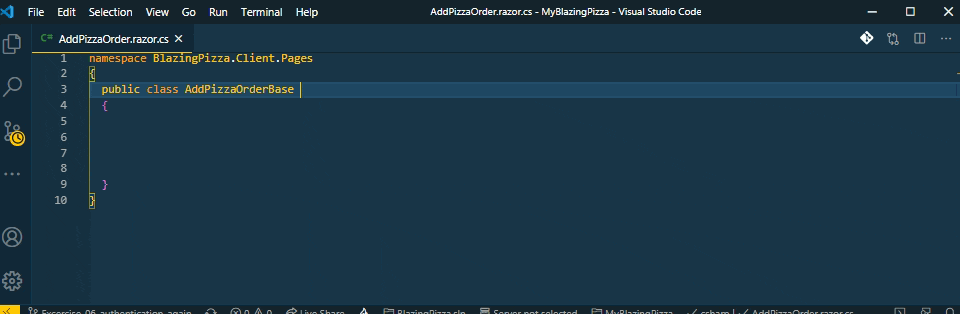

# Blazor Snippets `that start with an y`

## C# code-behind files [(source code)](https://github.com/bartvanhoey/Blazory/blob/master/snippets/csharp.json)

| Prefix                                 | Description                                |
| -------------------------------------- | ------------------------------------------ |
| `yAddHttpClientWithHttpMessageHandler` | Add HttpClient with HttpMessageHandler     |
| `yApiController`                       | ApiController attribute                    |
| `yAuthorizeAttribute`                  | AuthorizeAttribute                         |
| `yCascadingParaAuthState`              | Cascading parameter AuthenticationState    |
| `yCascadingPara`                       | CascadingParameter attribute               |
| `yCompareAttribute`                    | Compare attribute                          |
| `yEventCallbackExtended`               | EventCallbackExtended parameter            |
| `yEventCallbackOnParameterChanged`     | EventCallbackOnParameterChanged            |
| `yEventCallback`                       | EventCallback parameter                    |
| `yEventHandlerAsync`                   | EventHandlerAsync method stub              |
| `yEventHandler`                        | EventHandler method stub                   |
| `yHttpClientDeleteAsync`               | HttpClient.DeleteAsync call                |
| `yHttpClientGetAsync`                  | HttpClient.GetAsync call                   |
| `yHttpClientGetFromByIdJsonAsync`      | HttpClient.GetFromByIdJsonAsync call       |
| `yHttpClientGetFromJsonAsync`          | HttpClient.GetFromJsonAsync call           |
| `yHttpClientPostAsJsonAsync`           | HttpClient.PostAsJsonAsync call            |
| `yHttpClientPostAsync`                 | HttpClient.PostAsync call                  |
| `yHttpClientPutAsJsonAsync`            | HttpClient.PutAsJsonAsync call             |
| `yInheritsComponentBase`               | Inherits ComponentBase                     |
| `yInjectHttpClientField`               | Readonly HttpClient field                  |
| `yInjectHttpClient`                    | Inject HttpClient property                 |
| `yInjectIJSRuntime`                    | Inject IJSRuntime property                 |
| `yInjectIMapper`                       | Inject IMapper property                    |
| `yInjectNavigationManager`             | Inject NavigationManager property          |
| `yInjectService`                       | Inject MyService MyService                 |
| `yInjectSignOutSessionStateManager`    | Inject SignOutSessionStateManager property |
| `yInvokeAsyncEventCallback`            | Invoke async Eventcallback                 |
| `yJSRuntimeInvokeAsync`                | JSRuntimeInvokeAsync call                  |
| `yJSRuntimeInvokeVoidAsync`            | JSRuntimeInvokeVoidAsync call              |
| `yMethodAsyncReturn`                   | async method stub                          |
| `yMethodAsync`                         | async method stub                          |
| `yMethodReturn`                        | method stub                                |
| `yMethodVoidReturn`                    | void method stub                           |
| `yNavigateToId`                        | NavigationManager.NavigateTo page\Id       |
| `yNavigateTo`                          | NavigationManager.NavigateTo page          |
| `yOnAfterRenderAsync`                  | OnAfterRenderAsync method stub             |
| `yOnAfterRender`                       | OnAfterRender method stub                  |
| `yOnInitializedAsync`                  | OnInitializedAsync method stub             |
| `yOnInitialized`                       | OnInitialized method stub                  |
| `yOnParametersSet`                     | OnParameterSet method stub                 |
| `yParameterCaptureUnmatchedValues`     | Parameter CaptureUnmatchedValues attribute |
| `yParameter`                           | Parameter attribute                        |
| `yReadIdFromJsonAsync`                 | HttpClient.ReadFromJsonAsync\<int> call    |
| `yRequiredAttribute`                   | RequiredAttribute                          |
| `yRouteAttribute`                      | RouteAttribute                             |
| `ySetParametersAsync`                  | SetParametersAsync method stub             |
| `yShouldRender`                        | ShouldRender method stub                   |

## Razor files [(source code)](https://github.com/bartvanhoey/Blazory/blob/master/snippets/razor.json)

| Prefix                              | Description                                            |
| ----------------------------------- | ------------------------------------------------------ |
| `yAuthorizeAttribute`               | @attribute [Authorize]                                 |
| `yBindFormat`                       | @bind:format="MyFormat"                                |
| `yBindOnInputEvent`                 | @bind:event="oninput"                                  |
| `yBindOnProperty`                   | @bind="MyProperty""                                    |
| `yBindValue`                        | @bind-Value="MyProperty"                               |
| `yBind`                             | @bind="MyProperty"                                     |
| `yCascadingAuthenticationState`     | CascadingAuthenticationState stub                      |
| `yCode`                             | @code block                                            |
| `yComponentChildContent`            | Complete component with Child content                  |
| `yComponentDisposable`              | Complete component inherits IDisposable                |
| `yComponent`                        | Complete component                                     |
| `yDataAnnotationsValidator`         | DataAnnotationsValidator                               |
| `yEditForm`                         | Inserts EditForm component                             |
| `yFormControlClass`                 | Adds form-control class to html element                |
| `yFormGroupInputCheckBox`           | Inserts form-group class InputCheckBox component       |
| `yFormGroupInputDate`               | Inserts form-group class InputDate component           |
| `yFormGroupInputNumber`             | Inserts form-group class InputNumber component         |
| `yFormGroupInputSelectForEach`      | Inserts form-group class InputSelect ForEach           |
| `yFormGroupInputSelect`             | Inserts form-group class InputSelect component         |
| `yFormGroupInputTextArea`           | Inserts form-group class InputTextArea component       |
| `yFormGroupInputText`               | Inserts form-group class InputText component           |
| `yImplementsIDisposable`            | @implements IDisposable                                |
| `yInheritsBaseComponent`            | @inherits C# code-behind base class                    |
| `yInheritsLayoutComponentBase`      | Complete Layout component inherits LayoutComponentBase |
| `yInjectHttpClient`                 | @inject HttpClient directive                           |
| `yInjectIJSRuntime`                 | @inject IJSRuntime directive                           |
| `yInjectIMapper`                    | @inject IMapper directive                              |
| `yInjectNavigationManager`          | @inject NavigationManager directive                    |
| `yInjectService`                    | @inject MyService MyService                            |
| `yInjectSignOutSessionStateManager` | @inject SignOutSessionStateManager directive           |
| `yInputCheckbox`                    | Built-in InputCheckbox component                       |
| `yInputDate`                        | Built-in InputDate component                           |
| `yInputNumber`                      | Built-in InputNumber component                         |
| `yInputSelectForEach`               | Built-in InputSelectForEach component                  |
| `yInputSelect`                      | Built-in InputSelect component                         |
| `yInputTextArea`                    | Built-in InputTextArea component                       |
| `yInputText`                        | Built-in InputText component                           |
| `yLayout`                           | @layout MyLayout                                       |
| `yNavLinkMatch`                     | NavLink with MatchAttribute                            |
| `yNavLink`                          | NavLink                                                |
| `yOnValidSubmit`                    | OnValidSubmit                                          |
| `yPageParam`                        | @page directive with Parameter                         |
| `yPage`                             | @page directive                                        |
| `yPreventDefault`                   | @preventDefault                                        |
| `yRef`                              | @ref="MyProperty"                                      |
| `yTemplatedComponent`               | Templated component                                    |
| `yTypeParam`                        | @typeParam                                             |
| `yUsing`                            | @using MyNameSpace                                     |
| `yValidationMessageFor`             | ValidationMessageFor                                   |
| `yValidationSummary`                | ValidationSummary component                            |
| `yVoidDispose`                      | Dispose method stub                                    |

## Some handy C# snippets

| Prefix             | Description              |
| ------------------ | ------------------------ |
| `yIfInline`        | If inline statement      |
| `yIfNotNullInline` | If null inline statement |
| `yIfNotNull`       | If null statement        |
| `yIfNullInline`    | If null inline statement |
| `yIfNull`          | If null statement        |
| `yIf`              | If statement             |
| `yIsNotNull`       | != null                  |
| `yIsNull`          | == null                  |
